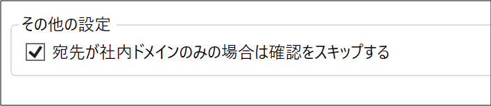

===================================
FlexConfirmMail v22.0リリースノート
===================================

FlexConfirmMail v22.0は2022年4月11日にリリースされたバージョンです。

.. contents::
   :local:
   :backlinks: none

新機能
======

1. 新しい設定画面を導入しました
-------------------------------

このバージョンから、FlexConfirmMailに新しい設定画面が付属しています。
FlexConfirmMailのすべての設定はこの画面から変更できます。

新しい設定画面にはOutlookの「ホーム」タブからアクセスできます。

FlexConfirmMailのアイコンをクリックすると、次のような画面が表示されます。

.. figure:: ../_static/ConfigDialog.png
   :width: 400

詳しい利用方法は :any:`../quickstart` を参照ください。

2. 多言語サポートを追加しました
-------------------------------

従来は日本語のみサポートしていましたが、英語と中国語を正式にサポートしました。

.. list-table::

   * - .. figure:: ../_static/ConfigDialogEnglish.png
          :width: 400

          英語版

     - .. figure:: ../_static/ConfigDialogChinese.png
          :width: 400

          中国語版

単一のインストーラですべての言語に対応しています。
Windowsの言語設定（設定 > 言語 > Windowsの表示言語）を検出して、
自動的に表示言語が切り替わる仕組みです。

3. 設定「宛先が社内のみの場合は確認をスキップする」を追加しました
-----------------------------------------------------------------

社外の宛先が含まれないメールについては、確認画面をスキップして送信できるようになりました。

機能を有効化するには、設定画面から「基本設定 > 宛先が社内ドメインのみの場合は確認をスキップする」にチェックを入れて下さい。
