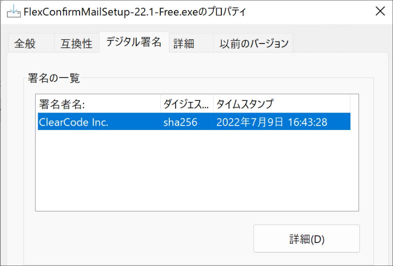

===================================
FlexConfirmMail v22.1リリースノート
===================================

FlexConfirmMail v22.1は2022年7月9日にリリースされたバージョンです。

.. contents::
   :local:
   :backlinks: none

新機能
======

1. 社内の宛先に「一括チェック」ボタンを追加しました
---------------------------------------------------

メール送信時の確認画面に「一括チェック」ボタンを追加しました。
このボタンをクリックすることで、社内の宛先を一括で選択状態にできます（下図）

.. figure:: ../_static/CheckAll.gif
   :width: 400

2. LegacyExchangeDNアドレスに対応しました
-----------------------------------------

LegacyExchangeDNとは、Exchangeが定める独自形式のアドレスで、
Active Directory組織のメンバーを一意に識別するアドレスです。

Exchangeは、組織内の宛先については、通常のSMTPのメールアドレス ``(foo@example.com)`` ではなく、
このアドレスを利用して送受信を行います::

   /o=FlexConfirmMail/ou=Exchange/cn=Recipients/cn=n000000-fujimoto

これまでのリリースでは、LegacyExchangeDNアドレスの宛先については、
「Exchange」という独立の表題にまとめて表示していました。

.. figure:: ../_static/LegacyDN.png
   :width: 450

今回のリリースから、LegacyExchangeDNのアドレスは、
対応するSMTPのメールアドレスを解決して表示するようになりました。

.. figure:: ../_static/LegacyDNResolved.png
   :width: 450

3. GPOで既定値を管理できるようになりました（エンタープライズ版）
----------------------------------------------------------------

エンタープライズ版について、グループポリシーで各設定の既定値を
制御できるようになりました。

.. figure:: ../_static/PolicyDefault.png
   :width: 500

バグ修正
========

1. アンダースコアの表示を改善しました
-------------------------------------

メールアドレスや添付ファイル名にアンダースコア文字が含まれる場合に、
表示が崩れる問題を修正しました。

2. Intel GPUのドライバ不具合に対応しました
------------------------------------------

Windows 10 + Intel GPUドライバの組み合わせで、FlexConfirmMailの画面が白紙になる問題を解消しました。

その他
======

1. FlexConfirmMailのアイコン位置が右端になりました
--------------------------------------------------

従来、FlexConfirmMailの「ホーム」タブのアイコンは「返信」グループの右隣に表示されていましたが、
本バージョンからタブの末尾に表示されるようになりました。

.. figure:: ../_static/HomeTab.png
   :width: 500

2. インストーラにデジタル署名を追加しました
-------------------------------------------

これまではエンタープライズ版のインストーラについてのみ、
開発元のクリアコードの署名を付していました。

今回のリリースから、公開版のインストーラについてもデジタル署名を付与して配布しています。

