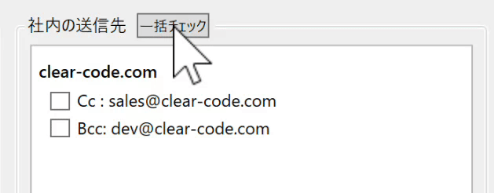
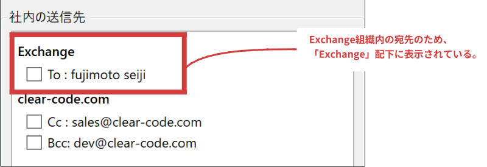
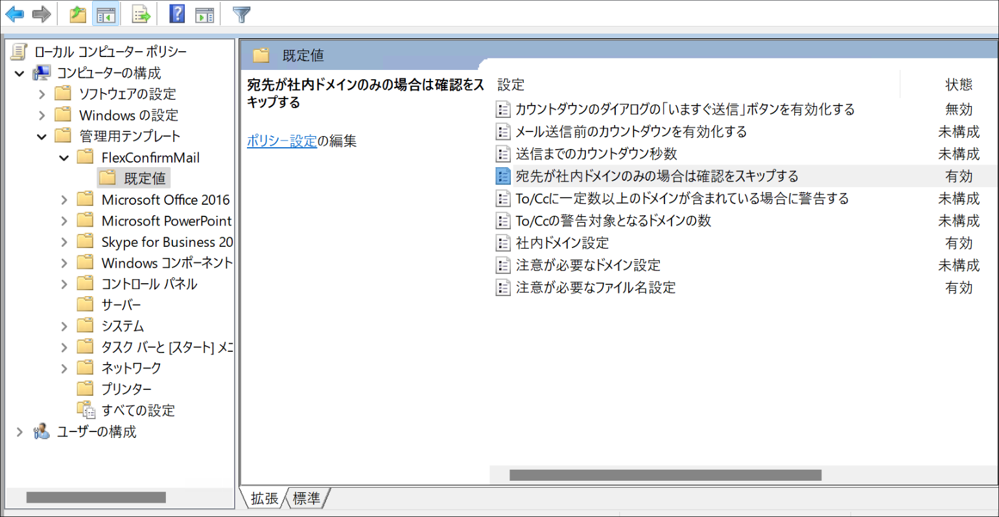

:orphan:

===================================
FlexConfirmMail v22.1リリースノート
===================================

FlexConfirmMail v22.1は2022年7月にリリース予定のバージョンです。

.. contents::
   :local:
   :backlinks: none

新機能
======

1. 社内の宛先を一括チェックできるようになりました
-------------------------------------------------

このバージョンから、確認ダイアログに『一括チェック』ボタンが追加されています。
このボタンをクリックすることで、全ての社内の宛先を確認済み状態にすることができます。

ユーザーからの「外部の宛先は慎重なチェックが必要だが、
社内の宛先については効率的に確認したい」という要望に応えた機能です。

2. ExchangeのLegacyDNアドレスに対応しました
-------------------------------------------

このバージョンから、Exchangeの内部アドレス（LegacyExchangeDN）について、
SMTPのメールアドレスを検出して表示するようになりました。

LegacyExchangeDNとは、Exchangeの独自形式のアドレスで、
組織内の宛先については、次の形式のアドレスで送受信が行われます::

   /o=FlexConfirmMail/ou=Exchange/cn=Recipients/cn=n000000-fujimoto

今回のリリースまでは、LegacyExchangeDN形式の送信先について、
次のように表示していました。

この表示が分かり難いという要望があったため、このバージョンから
LegacyExchangeDNに紐づくメールアドレスを解決して表示するように実装しました。

.. figure:: ../_static/LegacyDNResolved.png
   :width: 450

3. GPOで既定値を管理できるようになりました（エンタープライズ版）
---------------------------------------------------------------

エンタープライズ版について、グループポリシーでFlexConfirmMailの
「既定値」を管理できるようになりました。

情報システムの管理者が推奨値として一連の初期設定を入力し、
エンドユーザーが個別の事情に応じて設定を微調整する、という運用フローを実現します。

バグ修正
========

1. アンダースコアの表示を改善しました
-------------------------------------

メールアドレスや添付ファイル名にアンダースコア文字が含まれる場合に、
表示が崩れる問題を修正しました。

2. Intel GPUのドライバ不具合に対応しました
------------------------------------------

Windows 10 + Intel GPUドライバの組み合わせで、FlexConfirmMailの画面が白紙になる問題を解消しました。

その他
======

1. FlexConfirmMailのアイコン位置が右端になりました
--------------------------------------------------

従来、FlexConfirmMailの「ホーム」タブのアイコンは「返信」グループの右隣に表示されていましたが、
本バージョンからタブの末尾に表示されるようになりました。

.. figure:: ../_static/HomeTab.png
   :width: 500
