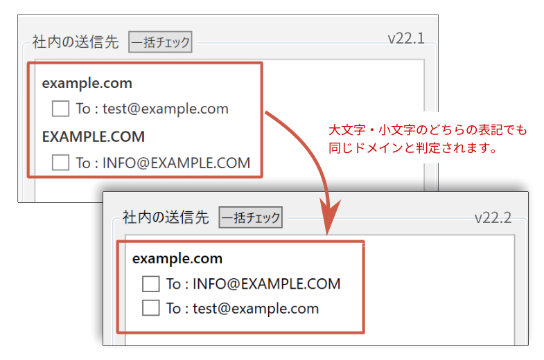

===================================
FlexConfirmMail v22.2リリースノート
===================================

FlexConfirmMail v22.2は2022年12月2日にリリースされたバージョンです。

.. contents::
   :local:
   :backlinks: none

新機能
======

1. ドメインの大文字・小文字の表記揺れに対応しました
---------------------------------------------------

ドメインを判定する場合に、大文字・小文字の表記揺れを吸収するようになりました。

Active Directoryの登録レコードで、企業ドメインの表記に揺らぎがあるケースを想定した機能です。

お知らせ
========

1. 次回のリリースの計画について
-------------------------------

* 2022年のマイナーバージョンリリースは、予定しているものとしては今回が最後になります。
* 次回のリリースは、来年の春頃を予定しています。

.. figure:: ../_static/release.svg
   :width: 600
