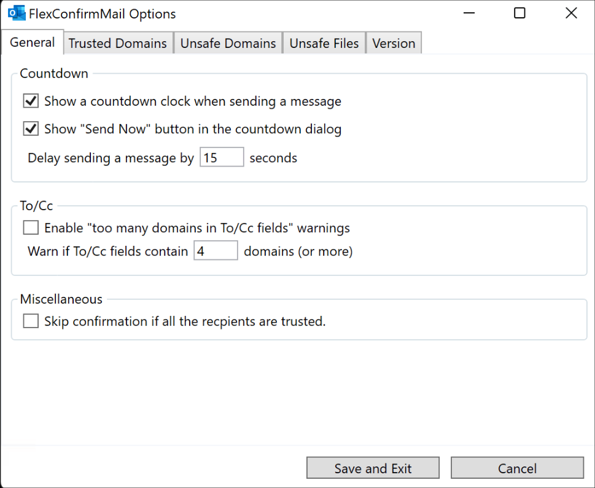

===========
HowToガイド
===========

このページは、FlexConfirmMailのよくある使い方やカスタマイズをまとめた運用マニュアル集です。

.. contents::
   :local:
   :backlinks: none

よくある誤送信とその対策
========================

To/Cc・Bccの使い分けのミスを検出する
------------------------------------

多数の宛先に一斉送信する場合、To/Ccを利用すると個人情報が漏洩してしまうため、
Bccを利用して送信する必要があります。

このミスを検知する機能として、To/Ccに多数のドメインが含まれる場合に、警告を出力できます。

.. list-table::
   :widths: 10 10

   * - 1. OutlookのホームタブからFlexConfirmMailのアイコンをクリックします。

     - .. figure:: _static/Ribbon.png
          :width: 95%

   * - 2. 「To/CCに一定数以上のドメインが含まれている場合に警告する」にチェックを入れ、警告対象のしきい値を設定します。

     - .. figure:: _static/SafeBcc.png
          :width: 95%

   * - 3. 「設定を保存して終了」を押下すれば完了です。

     -

   * - 4. 送信時に次のような警告が表示されます。

     - .. figure:: _static/SafeBccExample.png
          :width: 95%

不審なドメインへの送信をチェックする
------------------------------------

次のようなケースを想定した機能です。

* 通常の業務ではフリーメールアドレスとは疎通しないので、送信時に注意を促したい。
* 自社とよく似たドメインがあり、タイプミスが疑われる場合に警告を出したい。

この場合は、次の手順で注意が必要なドメインを設定することができます。

.. list-table::
   :widths: 10 10

   * - 1. OutlookのホームタブからFlexConfirmMailのアイコンをクリックします。

     - .. figure:: _static/Ribbon.png
          :width: 95%

   * - 2. 「注意が必要なドメイン」を選択し、ドメインを記入します。

     - .. figure:: _static/UnsafeDomains.png
          :width: 95%

   * - 3. 「設定を保存して終了」を押下すれば完了です。

     -

   * - 4. 条件に該当した場合、次のような警告が表示されます。

     - .. figure:: _static/UnsafeDomainsExample.png
          :width: 95%

社内の宛先のみの場合は確認をスキップする
----------------------------------------

送信確認の手間を簡略化する機能です。
宛先に外部ドメインが含まれない場合は、即座に送信を実行するように設定できます。

.. list-table::
   :widths: 10 10

   * - 1. OutlookのホームタブからFlexConfirmMailのアイコンをクリックします。

     - .. figure:: _static/Ribbon.png
          :width: 95%

   * - 2. 基本設定の「宛先が社内ドメインのみの場合は確認をスキップする」にチェックを入れます。

     - .. figure:: _static/SkipIfNoExt.png
          :width: 95%

   * - 3. 「設定を保存して終了」を押下すれば完了です。

     -

   * - 4. 設定後の送信フローの例を右に示します。

     -  .. figure:: _static/SkipIfNoExtExample.png
           :width: 400

アドインを社内で展開する
========================

インストーラをサイレント実行する
--------------------------------

FlexConfirmMailを資産管理ソフトウェアで配布する場合、
ダイアログを表示せずにインストール処理を実行する必要があります。

この場合は次のように ``/SILENT`` オプションを付して実行ください。

::

    % FlexConfirmMailSetup.exe /SILENT

アドインを多言語環境に展開する
------------------------------

FlexConfirmMailは日本語・英語・中国語の三カ国語に対応しています。

標準のインストーラに、各言語版の翻訳リソースも同梱されています。
Windowsの言語設定（設定 > 言語 > Windowsの表示言語）を検出して、
自動的に表示言語が切り替わりますので、単純にインストールすれば問題ありません。

   英語環境での表示例

アドインが自動的に無効化されるのを防ぐ
--------------------------------------

Office 2013以降にはパフォーマンスを自動的に最適化する機能が組み込まれており、
その一環としてアドインを自動的に無効化することがあります [#f1]_

FlexConfirmMailが自動的に無効化されるのを防止するには、
グループポリシーで下記の設定を追加ください。

1. グループポリシーエディタを開き、「ユーザーの構成」を開く。

2. 「管理用テンプレート > Microsoft Outlook 2016 > その他」を順番に選択する。

3. 「管理対象アドインの一覧」の項目をダブルクリックする。

4. 設定を「有効」にした上で、オプション欄の「表示」ボタンをクリックする。

5. 値の名前に FlexConfirmMail と入力し、値を 1 に設定する。

   .. figure:: _static/resiliency.png
      :width: 60%

6. 「OK」ボタンを押下して確定する。

エンタープライズ版
==================

グループポリシーで既定値を管理する
----------------------------------

* 有償で配布している :doc:`エンタープライズ版 <enterprise>` は、集中管理機能を搭載しています。
* 以下では「社内ドメイン」の設定を例に組織の既定値を設定する方法を解説します。

.. list-table::
   :widths: 10 10

   * - 1. 契約時に共有されたURLからポリシーテンプレートを入手し、配置します。

     - .. figure:: _static/PolicyADMX.png
          :width: 95%

   * - 2. グループポリシーエディタを起動して
          「コンピューターの構成 > FlexConfirmMail > 既定値」を選択します。

     - .. figure:: _static/PolicyDefault.png
          :width: 95%

   * - 3. 「社内ドメイン設定」を選択し、自社ドメインを登録します。

          「有効」を選択し、テキスト欄に一行に一件ずつ入力します。

     - .. figure:: _static/PolicyTrustedDomains.png
          :width: 95%

   * - 4. 「OK」ボタンを押下すれば完了です。

     -

   * - 5. ユーザーの設定画面では次のように表示されます。

          組織の推奨ポリシーに対して、個別の事情に応じた微調整が可能になります。

     - .. figure:: _static/PolicyUserConfig.png
          :width: 95%

.. rubric:: 脚注

.. [#f1] 詳しくはMicrosoft公式ドキュメント `Support for keeping add-ins enabled <https://docs.microsoft.com/en-US/office/vba/outlook/Concepts/Getting-Started/support-for-keeping-add-ins-enabled>`_ を参照ください。
