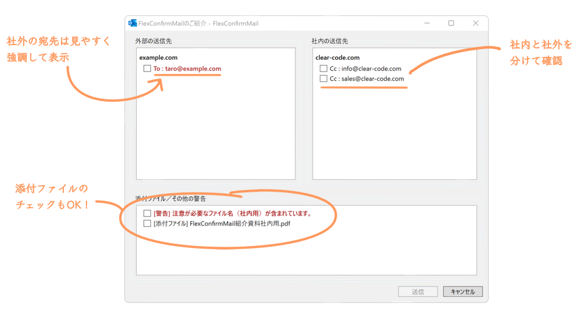

===========================
FlexConfirmMailプロジェクト
===========================

**FlexConfirmMailは、誤送信対策ソリューションです。**
企業のメール運用において大きな課題となる送信ミスの問題を解決します。

Microsoft Outlookのアドインとして導入することで、
今日から誤送信対策を始めることができます。

このページは、Outlook向けの情報です。
Thunderbird向けの情報は `FlexConfirmMail :: Thunderbird向けアドオン <https://addons.thunderbird.net/ja/thunderbird/addon/flex-confirm-mail/>`_ を参照してください。

更新情報
========

* 2025-02-28 :any:`top`を更新しました

コンテンツリンク
================

.. list-table::
   :class: table-of-contents

   * - :any:`quickstart`

       FlexConfirmMailの導入方法と基本的な使い方を説明します

     - :any:`howto`

       FlexConfirmMailのよくある使い方をまとめた運用マニュアル集です。

.. toctree::
   :hidden:

   quickstart.rst
   howto.rst
