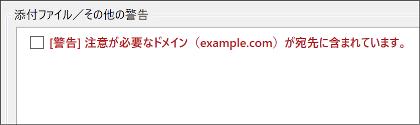
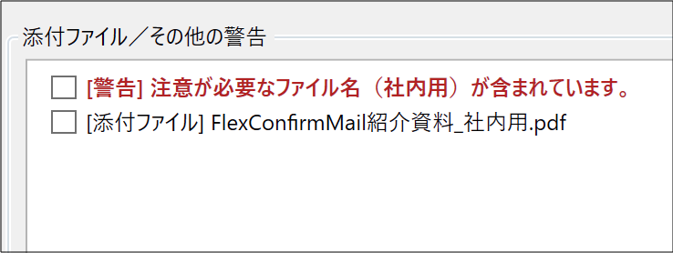

================
クイックスタート
================

本記事では、FlexConfirmMailをOutlookに導入する方法について解説します。

.. contents:: 目次
   :local:
   :backlinks: none

インストール
============

FlexConfirmMailをインストールする
---------------------------------

.. list-table::
   :widths: 10 10

   * - 1. FlexConfirmMailSetup.exe を実行します。

          なお、FlexConfirmMailの最新版インストーラは  :any:`download` で配布しています。

     - .. figure:: _static/installer.png
          :width: 95%

   * - 2. ウィザード完了後、Outlookの「ホーム」にFlexConfirmMailが追加されていれば成功です。

     - .. figure:: _static/Ribbon.png
          :width: 95%

   * - 3. これでインストール手順は完了です！

     -

.. hint::

    FlexConfirmMailのアドオンが読み込まれなかった場合は、
    Outlookの「ファイル > オプション」から、有効なアドオンの一覧に
    FlexConfirmMailが登録されていることを確認してください。

設定とカスタマイズ
==================

社内ドメインを設定する
----------------------

送信チェック時に社内の宛先として扱うドメインの一覧を設定します。

.. list-table::
   :widths: 10 10

   * - 1. 「FlexConfirmMail設定 > 社内ドメイン」を選択します。

          設定画面の例に従って、社内のドメイン（例えば「clear-code.com」など）を追記します。

     - .. figure:: _static/TrustedDomains.png
          :width: 95%

   * - 2. 「設定を保存して終了」を押下すれば完了です。

     -

注意が必要なドメインを設定する
------------------------------

宛先に含まれる場合に、特に注意が必要なドメインの一覧を設定します。

.. list-table::
   :widths: 10 10

   * - 1. 「FlexConfirmMail設定 > 注意が必要なドメイン」を選択します。

          設定画面の例に従って、ドメインを追記します。

     - .. figure:: _static/UnsafeDomains.png
          :width: 95%

   * - 2. 「設定を保存して終了」を押下すれば完了です。
     -

**注意が必要なドメインの警告例**

注意が必要なファイル名を設定する
--------------------------------

注意が必要な添付ファイルのキーワードを設定します。

.. list-table::
   :widths: 10 10

   * - 1. 「FlexConfirmMail設定 > 注意が必要なファイル名」を選択します。

          設定画面の例に従って、キーワードを追記します。

     - .. figure:: _static/UnsafeFiles.png
          :width: 95%

   * - 2. 「設定を保存して終了」を押下すれば完了です。
     -

**注意が必要なファイル名の警告例**

運用に関するヒント
==================

インストーラをサイレント実行する
--------------------------------

組織の端末に配布する時などに、FlexConfirmMailをサイレントインストールしたい場合は、
次のように/SILENTオプションを利用します::

    % FlexConfirmMailSetup.exe /SILENT

アドオンが自動的に無効化されるのを防止する
------------------------------------------

Office 2013以降にはパフォーマンスを自動的に最適化する機能が組み込まれており、
その一環としてアドオンを自動的に無効化することがあります。

FlexConfirmMailが自動的に無効化されるのを防止するには、
グループポリシーで下記の設定を追加ください。

1. グループポリシーエディタを開き、「ユーザーの構成」を開く。

2. 「管理用テンプレート > Microsoft Outlook 2016 > その他」を順番に選択する。

3. 「管理対象アドオンの一覧」の項目をダブルクリックする。

4. 設定を「有効」にした上で、オプション欄の「表示」ボタンをクリックする。

5. 値の名前に FlexConfirmMail と入力し、値を 1 に設定する。

   .. figure:: _static/resiliency.png
      :width: 60%

6. 「OK」ボタンを押下して確定する。
