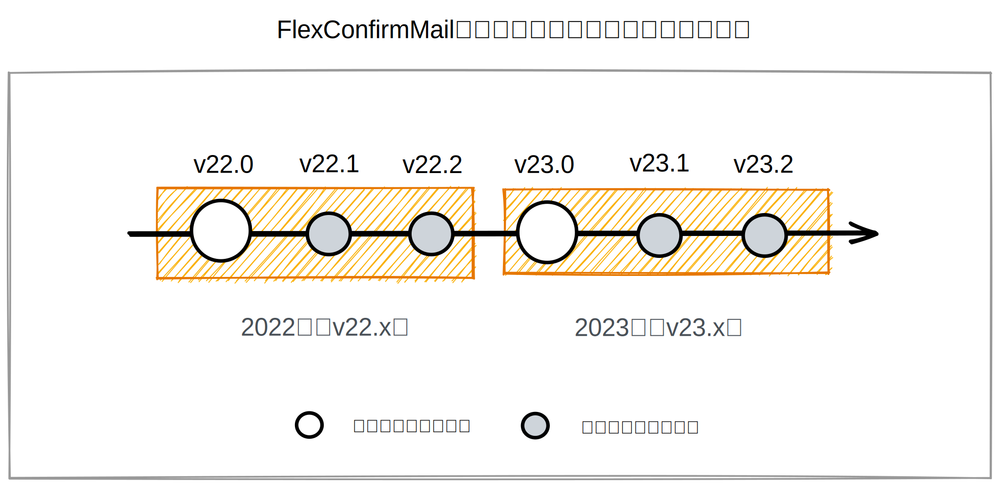

============
サポート情報
============

FlexConfirmMailは `株式会社クリアコード <https://www.clear-code.com/>`_ が開発するソフトウェアです。

公開済みバージョン
==================

.. list-table::
   :header-rows: 1
   :widths: 7 8 5 5

   * - リリース日
     - バージョン
     - インストーラ
     - リリースノート
   * - 2022年7月 (予定)
     - FlexConfirmMail v22.1
     - --
     - :any:`リリースノート <changelog/v22.1>`
   * - 2022年4月11日
     - FlexConfirmMail v22.0
     - :any:`インストーラ <thankyou>`
     - :any:`リリースノート <changelog/v22.0>`

リリーススケジュール
====================

FlexConfirmMailは年に1回、新しいメジャーバージョンをリリースします。
次のメジャーバージョンまでは、通例だと2〜3回のマイナーバージョンを公開しています。

それぞれのメジャーバージョンは、次のメジャーリリースまでサポートされます。

サポートについて
================

フリーソフトウェアプロジェクト
------------------------------

* FlexConfirmMailはISCライセンスで配布しているフリーソフトウェアです。
* 公開プロジェクトとしてのバグ報告は `GitHub Issues <https://github.com/FlexConfirmMail/Outlook/issues>`_ で受け付けています。

法人向けサポート
----------------

* 社内展開時などの法人向けサポートが必要な場合は、開発元のクリアコードが承ります。
* 契約の費用と特典については :any:`enterprise` を参照ください。
* 法人向けサポートに関する問い合わせは `こちらの問い合わせフォーム <https://www.clear-code.com/contact>`_ からお願いします。

.. toctree::
   :hidden:

   changelog/v22.0.rst

ISCライセンス
=============

本サイトを含めたOutlook版のFlexConfirmMailのソースコードおよびリソースはISCライセンスで配布しています。

.. code-block:: text

   Copyright 2021-2022 Fujimoto Seiji <fujimoto@clear-code.com>
   Copyright 2022 Yuki Hiroshi <yuki@clear-code.com>
   Copyright 2022 Yoshimoto Yukiko <yoshimoto@clear-code.com>

   Permission to use, copy, modify, and/or distribute this software for any
   purpose with or without fee is hereby granted, provided that the above
   copyright notice and this permission notice appear in all copies.

   THE SOFTWARE IS PROVIDED "AS IS" AND THE AUTHOR DISCLAIMS ALL WARRANTIES WITH
   REGARD TO THIS SOFTWARE INCLUDING ALL IMPLIED WARRANTIES OF MERCHANTABILITY AND
   FITNESS. IN NO EVENT SHALL THE AUTHOR BE LIABLE FOR ANY SPECIAL, DIRECT,
   INDIRECT, OR CONSEQUENTIAL DAMAGES OR ANY DAMAGES WHATSOEVER RESULTING FROM
   LOSS OF USE, DATA OR PROFITS, WHETHER IN AN ACTION OF CONTRACT, NEGLIGENCE OR
   OTHER TORTIOUS ACTION, ARISING OUT OF OR IN CONNECTION WITH THE USE OR
   PERFORMANCE OF THIS SOFTWARE.
